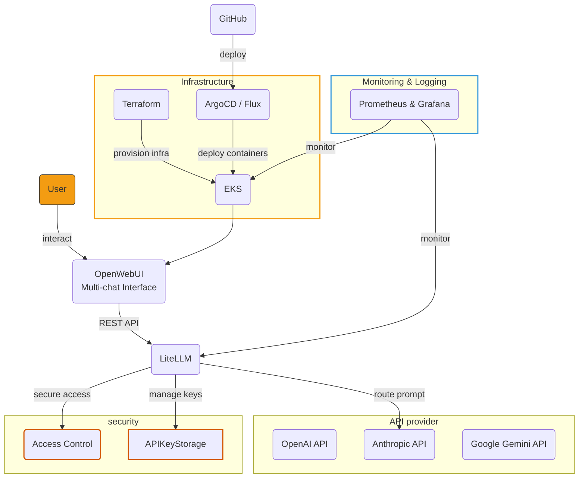
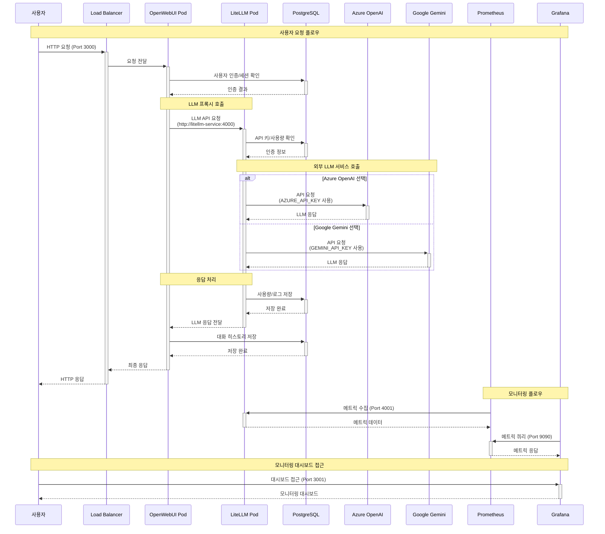

# Architecture Guide

# **AI Proxy 환경 구축을 활용한 API 기반 인하우스 AI 서비스**

### **1. 개요 (Overview)**

- 이 시스템은 기업 내부 데이터 보안을 유지하면서 다양한 대규모 언어 모델(LLM)을 유연하게 활용하는 것을 목표로 함. 주요 기술 스택은 AWS EKS, Docker, Kubernetes, LiteLLM, OpenWebUI이며, 전체 인프라는 Terraform을 통해 IaC로 관리.

### **2. 아키텍처 원칙**

- **Infrastructure as Code (IaC):** Terraform 을 사용하여 전체 인프라를 코드로 관리.
- **Cloud-Native:** AWS의 관리형 서비스(EKS, ELB, EBS 등)를 적극 활용
- **Containerization & Orchestration:** Docker 컨테이너와 Kubernetes(EKS)를 통해 서비스를 배포 및 관리

### **3. 아키텍처 뷰 (Architectural Views)**

[<AWS 배포 diagram>](https://lh7-rt.googleusercontent.com/docsz/AD_4nXf_a8zsMzFXwx0s2ZVasW8vrfy4ZHOph7zZroyNJI5W7gHvhNpG64bQlxPIsYpEDRl3FL9O68X7iUTfJfIvx7amTPpFtoW1d1glyIzI7lm453HENdiZv_VTyT775QTg2tKiIP3OiQ?key=Liugr4RUX5fMyJGq8nn-Ag)

<AWS 배포 diagram>

### **3.1. 배포 뷰 (Deployment View)****

- **클라우드 환경:** AWS에 구성
- **네트워크:** 10.38.0.0/16 CIDR의 VPC (aws_vpc.main) 내에 다중 가용 영역을 활용한 서브넷 (10.38.1.0/24, 10.38.2.0/24) 설정.
인터넷 게이트웨이 (aws_internet_gateway.main)와 라우트 테이블 (aws_route_table.main)을 통해 외부 통신 구성.
- **EKS 클러스터:** aws_eks_cluster.main (var.cluster_name)및 노드 그룹 (aws_eks_node_group.nodes)이 핵심 컴퓨팅 환경을 제공. IAM 및 보안 그룹으로 접근 제어
- **애플리케이션 배포 (Kubernetes):** var.namespace 네임스페이스에 배포. 본 코드에서는 default.
- **핵심 애플리케이션:**
    - kubernetes_deployment.litellm_deployment (AI API proxy)
    - kubernetes_deployment.openwebui_deployment (OpenWeb UI)
    - kubernetes_deployment.postgres_deployment (DB)
- **모니터링:**
    - kubernetes_deployment.prometheus_deployment
    - kubernetes_deployment.grafana_deployment
- **GitOps 도구:**
    - ArgoCD (argocd namespace에 배포)
- **서비스 노출:**
    - 외부 접근 가능:
        - OpenWebUI (Classic LB, var.openwebui_port)
        - LiteLLM API (NLB, var.litellm_api_port)
        - Prometheus (NLB, var.prometheus_port)
        - Grafana (Classic LB, var.grafana_port)
        - ArgoCD UI (LoadBalancer, Port 80/443)
    - 내부 접근: PostgreSQL (postgres-service, ClusterIP, Port 5432)

### **3.2. 논리적 뷰 (Component Interaction)**

- 사용자는 OpenWebUI를 통해 시스템과 상호작용.
OpenWebUI는 LiteLLM 프록시를 통해 다양한 외부 LLM(Azure, Gemini 등 명시된 API 키 기준)과 통신하며, PostgreSQL에 대화 기록 및 설정을 저장.
Prometheus는 LiteLLM 등에서 메트릭스를 수집하고, Grafana는 이를 시각화.

### **3.3. 개발 뷰 (Implementation View)**

- Terraform (main.tf)을 사용하여 전체 AWS 인프라 및 Kubernetes 애플리케이션 배포를 자동화. Github Actions를 통해 변동상황 자동 반영

### **4. 아키텍처 결정 사항 (Key Decisions)**

- **AWS EKS 및 Terraform 활용:** 관리형 Kubernetes 환경(EKS)과 IaC(Terraform)를 통해 운영 효율성 및 배포 자동화를 달성.
- **LiteLLM 및 OpenWebUI 도입:** 다양한 LLM을 유연하게 통합 관리(LiteLLM)하고, 사용자 친화적인 웹 인터페이스(OpenWebUI)를 제공.
- **Prometheus & Grafana 기반 모니터링 구축:** 시스템 및 애플리케이션의 상태를 효과적으로 관찰하기 위해 표준 오픈소스 모니터링 스택을 채택.

### **5. 기술 스택 (Core Technologies)**

- **Cloud:** AWS (EKS, VPC, ELB, EBS, IAM)
- **Infrastructure as Code (IaC):** Terraform
- **Containerization & Orchestration:** Docker, Kubernetes (AWS EKS)
- **Core Applications:** LiteLLM (AI Proxy), OpenWebUI (Frontend), PostgreSQL (Database)
- **Monitoring:** Prometheus, Grafana
- **CI/CD & GitOps :** GitHub Actions / ArgoCD v2.8+
- **Networking & Security :** AWS Load Balancer Controller / ACM (AWS Certificate Manager)

### **6. 인터페이스 (Key Interfaces)**

- **외부 사용자 접근:**
    - OpenWebUI (Web): `http://<ELB-DNS>:3000`
    - Grafana (Web): `http://<ELB-DNS>:3001`
    - ArgoCD UI: `http://<ELB-DNS>:80`
- **외부 API 접근:**
    - LiteLLM API: `http://<NLB-DNS>:4000`
    - Prometheus API/UI: `http://<NLB-DNS>:9090`
- **내부 컴포넌트 통신:**
    - Service Discovery: Kubernetes DNS
    - OpenWebUI → LiteLLM: `http://litellm-service:4000`
    - Applications → PostgreSQL: `postgres-service:5432`
- **CI/CD 인터페이스:**
    - GitHub Webhook → GitHub Actions
    - ArgoCD → GitHub Repository (HTTPS/SSH)
    - Terraform → AWS API
    - kubectl → EKS API Server

### **7. 운영 및 배포 (Operations & Deployment)**

- **배포 자동화:** Terraform (main.tf)을 사용하여 AWS 인프라부터 Kubernetes 애플리케이션까지 전체 배포 과정을 자동화.
- **모니터링:** Prometheus 및 Grafana를 통해 시스템 메트릭스를 수집하고 시각화하여 운영 상태를 관찰.
- **환경 변수 관리:** API 키, 데이터베이스 접속 정보 등 주요 설정은 Terraform 변수 (var.* 형태)를 통해 Kubernetes Deployment 환경 변수로 입력.