```mermaid
graph TD
    %% 사용ì í름
    User(User) -->|interact| OpenWebUI(OpenWebUI<br>Multi-chat Interface)
    OpenWebUI -->|REST API| LiteLLM(LiteLLM)

    %% LLM Providers
 
    subgraph API provider
	    OpenAI(OpenAI API)
	    Anthropic(Anthropic API)
	    Gemini(Google Gemini API)
    end
	  LiteLLM -->|route prompt| Anthropic
	  
    %% Security
    LiteLLM -->|secure access| AccessControl(Access Control)
    LiteLLM -->|manage keys| APIKeyStorage

    %% Infra / Orchestration
    subgraph Infra["Infrastructure"]
        Kubernetes(EKS)
        Terraform(Terraform)
        ArgoCD(ArgoCD / Flux)
    end

    Terraform -->|provision infra| Kubernetes
    ArgoCD -->|deploy containers| Kubernetes
    GitHub(GitHub) -->|deploy| ArgoCD

    %% Monitoring & Logging
    subgraph Monitoring["Monitoring & Logging"]
        Prometheus(Prometheus & Grafana)
   
    end
    
    subgraph security
	    AccessControl 
	    APIKeyStorage
	  end

    Prometheus -->|monitor| Kubernetes
    Prometheus -->|monitor| LiteLLM

    %% OpenWebUI Infra 연계
    Kubernetes --> OpenWebUI

    %% Style (optional)
    style User fill:#f39c12,stroke:#333,stroke-width:1px
    style Infra stroke:#f39c12,stroke-width:2px
    style Monitoring stroke:#3498db,stroke-width:2px
    style AccessControl stroke:#d35400,stroke-width:2px
    style APIKeyStorage stroke:#d35400,stroke-width:2px
```

# 🚀 OpenWebUI+LiteLLM 기반 in-house LLM solution

> **Open WebUI와 LiteLLM을 기반으로 당신만의 LLM 솔루션을 이용해보세요.**
> 
### 주요 구성 요소

| 구성 요소         | 설명                        | 역할                             |
| ----------------- | --------------------------- | -------------------------------- |
| **8dobibim_back** | 8dobibim이 준비한 terraform 코드 및 배포 가이드를 확인하실 수 있습니다. | 클라우드 인프라, CI/CD, 모니터링 |
| **open-webui**    | 저희 8dobibim이 수정한 version의 openwebui 코드를 확인할 수 있습니다. | API와의 상호작용을 위한 웹 인터페이스    |

아래 배포 가이드를 따라, 당신만의 솔루션을 시작해보세요!

### 핵심 기능

- 🌐 **다중 LLM 지원**: OpenAI, Anthropic, Ollama 등 다양한 AI 모델 통합
- ☁️ **클라우드 네이티브**: AWS EKS 기반의 확장 가능한 인프라
- 🔄 **완전 자동화**: Infrastructure as Code 및 GitOps 기반 배포
- 📈 **엔터프라이즈급**: 고가용성, 보안, 모니터링을 갖춘 운영 환경

## 🚀 프로젝트 구동 방법

### 🚀 AWS를 통해 구동 및 배포하기

AWS EKS 클러스터 및 관련 인프라를 배포하는 방법입니다.

#### 사전 준비사항

```bash
# 필수 도구 설치 확인
aws --version          # AWS CLI v2
terraform --version    # Terraform v1.5+
kubectl version        # kubectl v1.24+
```

#### 0단계: 본 repository clone 하기

```bash
git clone https://github.com/8dobibim/combined.git
```

#### 1단계: AWS 자격 증명 설정

```bash
aws configure
# Access Key ID, Secret Access Key, Region 설정
```

#### 2단계: 인프라 배포

```bash
cd 8dobibim_back/terraform-related/AWS_terraform_grafana

# Terraform 초기화
terraform init

# 배포 계획 확인
terraform plan #실행 전 fvars.example 파일 및 폴더 내 readme를 참고하여 설정을 마쳐주세요!

# 인프라 배포
terraform apply
```

#### 3단계: EKS 클러스터 연결

```bash
# kubectl 설정
aws eks update-kubeconfig --region ap-northeast-2 --name openwebui-eks-dev

# 클러스터 연결 확인
kubectl get nodes
```

#### 4단계 : litellm 설정 및 open webui 설정 후 사용하기
- 팀별 할당 / API 추가 / API 연결 등 어플리케이션에서 필요한 설정 끝내고 사용하기


### 🚀 로컬 환경에서 구동 및 배포하기

로컬 환경을 통해 인프라를 배포하는 방법입니다.

#### 사전 준비사항

```bash
# 필수 도구 설치 확인
terraform --version    # Terraform v1.5+
kubectl version        # kubectl v1.24+
```
#### 0단계: 본 repository clone 하기

```bash
git clone https://github.com/8dobibim/combined.git
```
#### 1단계: 인프라 배포하기

```bash
cd 8dobibim_back/terraform-related/local_provider_grafana

# Terraform 초기화
terraform init

# 배포 계획 확인
terraform plan #실행 전 fvars.example 파일 및 폴더 내 readme를 참고하여 설정을 마쳐주세요!

# 인프라 배포
terraform apply
```

#### 2단계: litellm 설정 및 open webui 설정 후 사용하기
- 팀별 할당 / API 추가 / API 연결 등 어플리케이션에서 필요한 설정 끝내고 사용하기

### 좀 더 자세히 알고 싶다면?

> 📘 **상세한 배포 가이드**: `8dobibim_back/README.md` 및 `docs/` 디렉토리의 한국어 문서를 참조하세요.
>
> - [사전준비사항](8dobibim_back/docs/사전준비사항.md)
> - [Terraform 설정](8dobibim_back/docs/terraform%20설정.md)
> - [AWS를 통한 배포 가이드](https://github.com/8dobibim/combined/blob/main/8dobibim_back/docs/%EC%95%A0%ED%94%8C%EB%A6%AC%EC%BC%80%EC%9D%B4%EC%85%98%20%EB%B0%B0%ED%8F%AC%20%EA%B0%80%EC%9D%B4%EB%93%9C.md)

> 📘 **상세한 운영 가이드**:
> 
> - [배포 검증 가이드](https://github.com/8dobibim/combined/blob/main/8dobibim_back/docs/%EB%B0%B0%ED%8F%AC%20%EA%B2%80%EC%A6%9D%20%EA%B0%80%EC%9D%B4%EB%93%9C.md)
> - [문제 해결 가이드](https://github.com/8dobibim/combined/blob/main/8dobibim_back/docs/%ED%8A%B8%EB%9F%AC%EB%B8%94%EC%8A%88%ED%8C%85%20%EA%B0%80%EC%9D%B4%EB%93%9C%20%26%20FAQ.md)


## 🏗️ 아키텍처

### 전체 시스템 아키텍처

### 인프라 아키텍처 (8dobibim_back)

```
AWS VPC (10.0.0.0/16)
├── Public Subnet A (10.0.1.0/24)
│   ├── Application Load Balancer
│   └── NAT Gateway A
├── Public Subnet B (10.0.2.0/24)
│   └── NAT Gateway B
├── Private Subnet A (10.0.10.0/24)
│   └── EKS Node Group A
│       ├── Open WebUI Pods
│       └── PostgreSQL
└── Private Subnet B (10.0.20.0/24)
    └── EKS Node Group B
        ├── LiteLLM Pods
        └── Monitoring Stack
```

### 애플리케이션 아키텍처 (open-webui)

```
Frontend (SvelteKit + TypeScript)
├── Chat Interface
├── Model Management
├── Settings & Configuration
└── PWA Support

Backend (FastAPI + Python)
├── Authentication & Authorization
├── Chat History Management
├── File Upload/Download
├── WebSocket Handler
└── API Integration

Data Layer
├── PostgreSQL (Main Database)
├── ChromaDB (Vector Database)
└── Redis (Cache & Session)

AI Integration
├── LiteLLM Proxy
├── OpenAI API
├── Anthropic API
└── Ollama Support
```

## 🛠️ 기술 스택

### 8dobibim_back (인프라)

| 영역         | 기술                | 용도                                |
| ------------ | ------------------- | ----------------------------------- |
| **클라우드** | AWS EKS, VPC, ALB   | 컨테이너 오케스트레이션 및 네트워킹 |
| **IaC**      | Terraform           | 인프라 자동화                       |
| **GitOps**   | ArgoCD              | 애플리케이션 배포                   |
| **모니터링** | Prometheus, Grafana | 시스템 모니터링                     |
| **CI/CD**    | GitHub Actions      | 자동화된 배포 파이프라인            |

### open-webui (애플리케이션)

| 영역             | 기술                               | 용도                |
| ---------------- | ---------------------------------- | ------------------- |
| **프론트엔드**   | SvelteKit, TypeScript, TailwindCSS | 사용자 인터페이스   |
| **백엔드**       | FastAPI, Python 3.11+              | API 서버            |
| **데이터베이스** | PostgreSQL, Redis, ChromaDB        | 데이터 저장 및 캐시 |
| **AI/ML**        | LangChain, sentence-transformers   | AI 모델 통합        |
| **컨테이너**     | Docker, Kubernetes                 | 애플리케이션 배포   |


## 📁 프로젝트 구조

```
combined/
├── 8dobibim_back/              # AWS EKS 인프라 구축 및 배포
│   ├── docs/                   # 한국어 운영 문서
│   ├── terraform-related/      # Terraform 파일들 (AWS / local)
│   ├── argocd/                # GitOps 배포 설정
│   └── README.md              # 인프라 배포 가이드
├── open-webui/                # AI 채팅 애플리케이션 (서브모듈)
│   ├── src/                   # SvelteKit 프론트엔드
│   ├── backend/               # FastAPI 백엔드
│   ├── kubernetes/            # K8s 배포 매니페스트
│   ├── docker-compose.yaml    # 로컬 개발 환경
│   └── README.md             # 애플리케이션 설치 가이드
├── CLAUDE.md                  # Claude Code 개발 가이드
└── README.md                  # 이 파일
```

---

## 📞 지원 및 문의

- **8dobibim_back 관련**: `8dobibim_back/docs/` 디렉토리의 한국어 문서 참조
- **이슈 리포트**: GitHub Issues 활용

---
